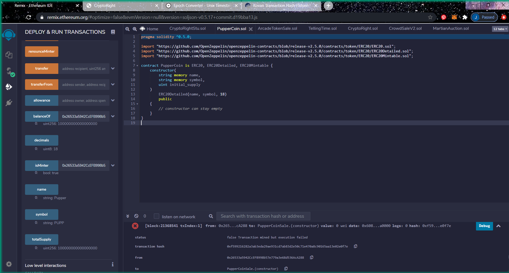
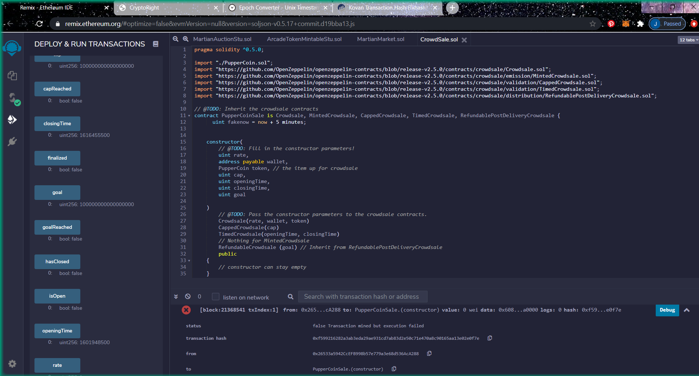
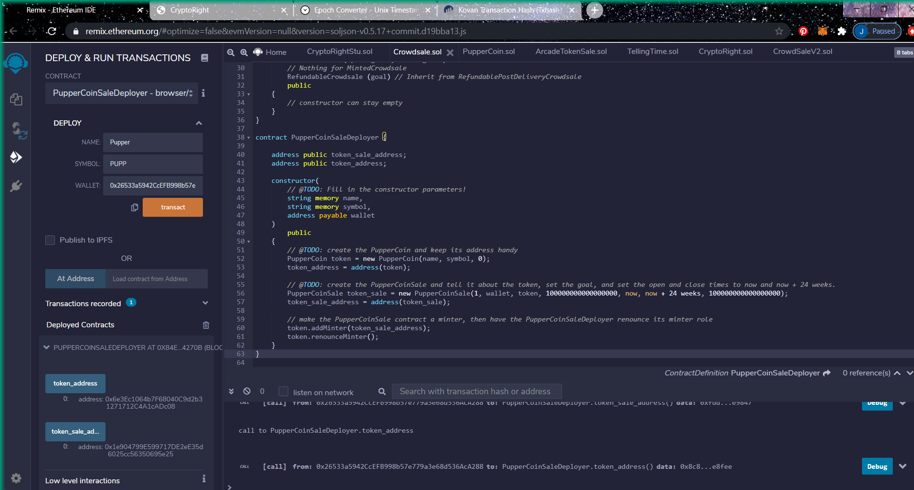
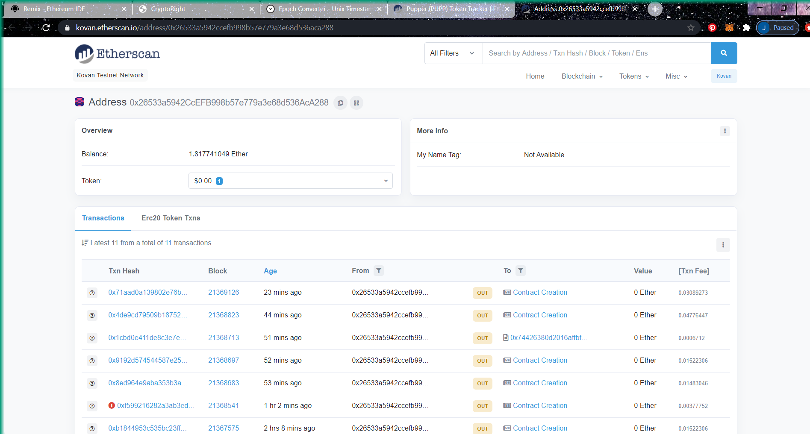
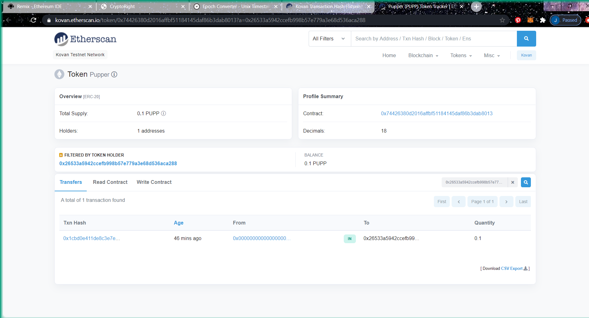

# PupperCoin
Crowdsale PupperCoin token in order to help fund network development.

## ERC20 PupperCoin

The PupperCoin contract pulls in the functions from the following:
* ERC20
* ERC20Detailed
* ERC20Mintable

These ERC20 functions allow a deployer a contract to create a token. The deployment allows the user to select the Name of the new token, provide a Symbol and set the initial supply.

### Pupper Coin deployment image

## CrowdSale

The CrowdSale pulls in the functions from the following:
* Crowdsale
* MintedCrowdsale
* CappedCrowdsale
* TimedCrowdsale
* RefundablePostDeliveryCrowdsale

The two contracts options are created within the file. 

> The first contract, PupperCoinSale, allows a deployer to input the constructor parameters to create a crowdsale (rate, wallet, token, cap, open time, close time and goal).

### Pupper Sale deployment image

> The second contract, PupperCoinSaleDeployer, is prefilled with coin attributes and only requires the deployer to the token and sale addresses.

### Pupper Deployer deployment image

## Etherscan

The Kovan Etherscan provides history of the contracts being deployed including the Fee for deployment. The site also shows the deposit of Pupper Coins.

### Etherscan Contract History

### Etherscan Pupper Coin Deposit

